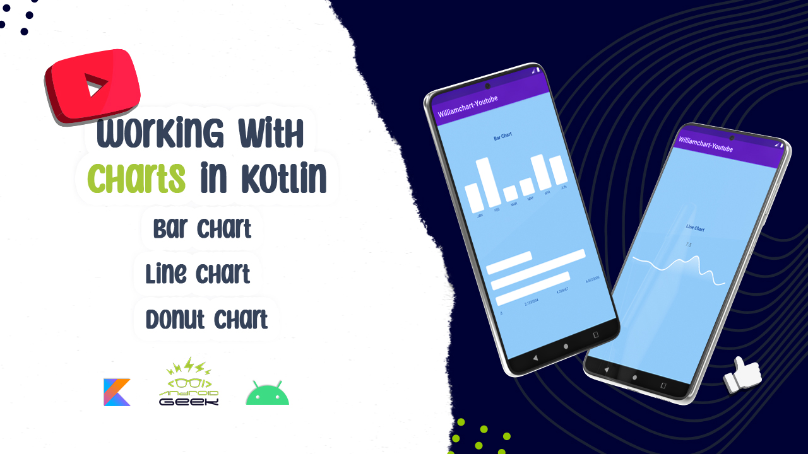

# Charts in Kotlin 

</a>
 
I will upload the video tomorrow morning [ 3 April ]:)
 
YouTube Video 
  

  
  
Article on Medium:
 

 
 

✨ Join Medium to read thousands of valuable stories ✨
 
https://medium.com/@ezatpanah/membership
